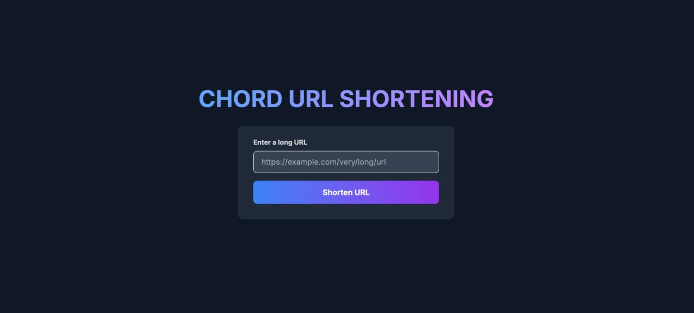
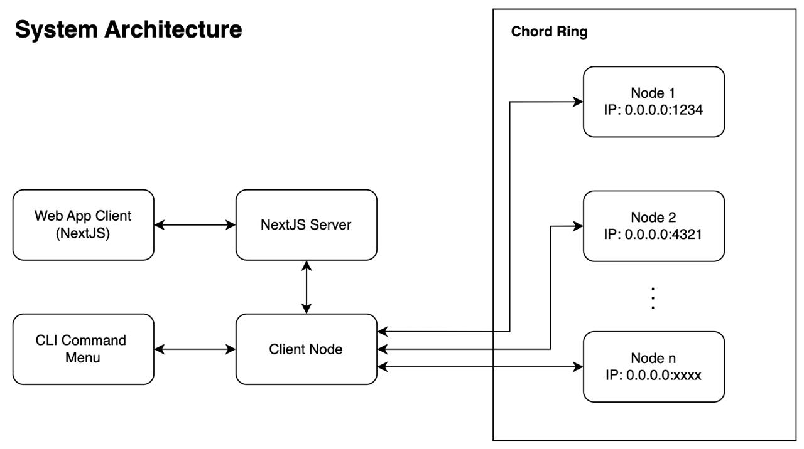
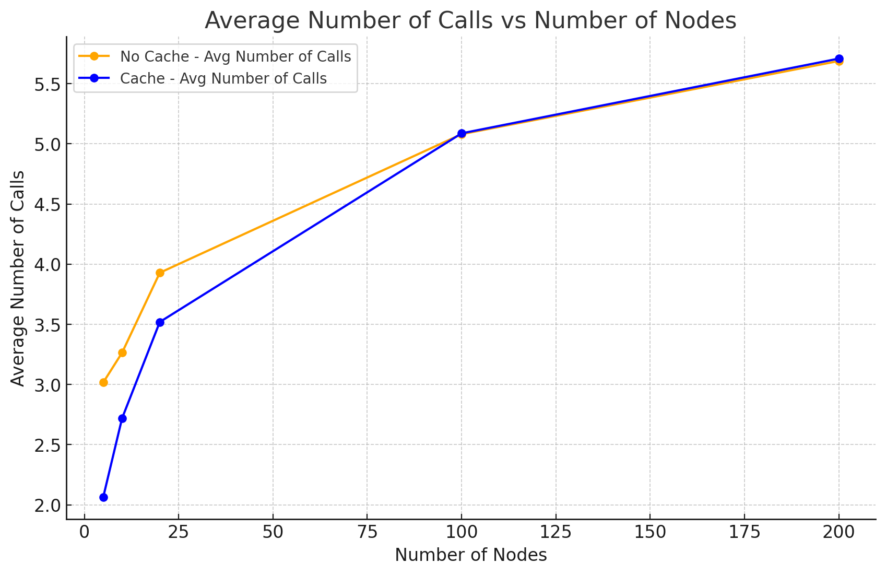
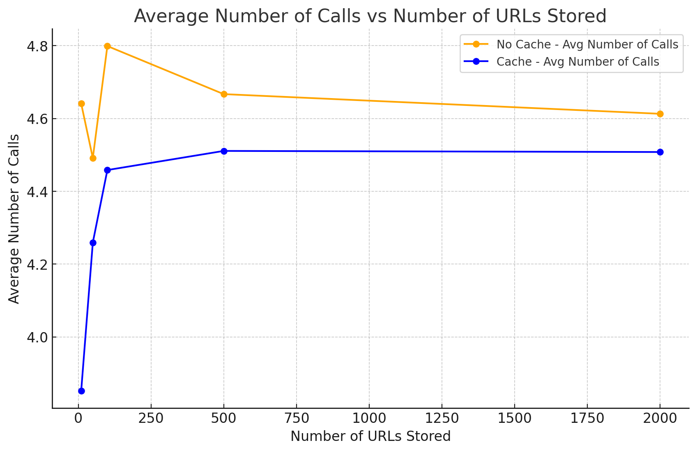
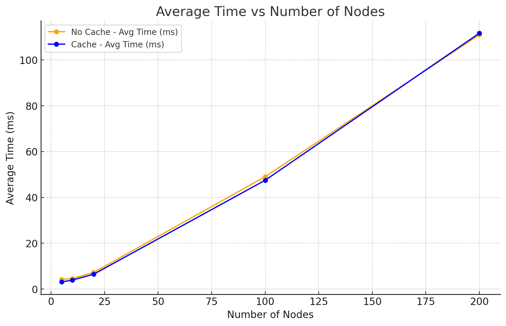
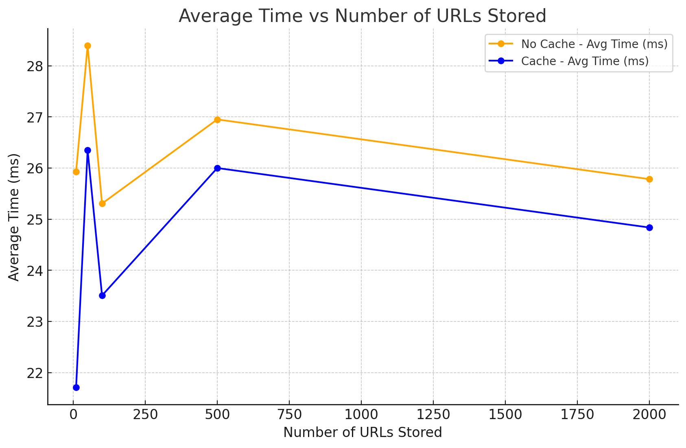

# chord-url-shortening

The chord-url-shortening project is a distributed computing implementation of url shortening using Google's Chord protocol, written in Golang. This project is for the 50.041 Distributed Systems and Computing course. The main goals of this project is to build a scalable and fault tolerant url-shortener, leveraging a distributed hash table (DHT) architecture. The project is built with a Golang backend and a Next.js frontend.

## Table of Contents

- [Demo](#demo)
- [Features](#features)
- [Getting Started](#getting-started)
- [Usage](#usage)
- [Architecture](#architecture)
- [Experiments](#experiments)
- [Acknowledgements](#acknowledgements)

---

## Demo

[Demo Video](https://youtube.com/example)



---

## Features

- **Distributed URL Shortening**: Utilizes the Chord protocol for efficient URL storage and retrieval.
- **Fault Tolerance**: Implements data replication and successor lists to ensure high availability.
- **Scalability**: Designed to handle a large number of nodes and URLs efficiently.
- **Caching**: Local caching mechanism to optimize URL retrieval and reduce latency.

---

## Getting Started

### Installation

```bash
# Clone the repo
git clone https://github.com/abramtan/chord-url-shortening.git

# Navigate to the frontend directory
cd src/frontend

# Install dependencies
npm install
```

---

## Usage
### Start Backend (Chord Ring)
```bash
# Navigate to the src directory
cd src

# Run the backend chord ring
go run backend/main.go
```

Enter `ADD` in the CLI interface to add nodes to the chord ring. For more details, check out `src/backend/README.md` for more details on the backend usage.

### Start Frontend (NextJS)
```bash
# Navigate to the frontend directory
cd src/frontend

# Run the frontend
npm run dev
```

On your browser, head to `http://localhost:3000` to access the web app.

---

## Architecture



---

## Experiments






---

## Acknowledgements

- [Inspiration](https://pdos.csail.mit.edu/papers/ton:chord/paper-ton.pdf)